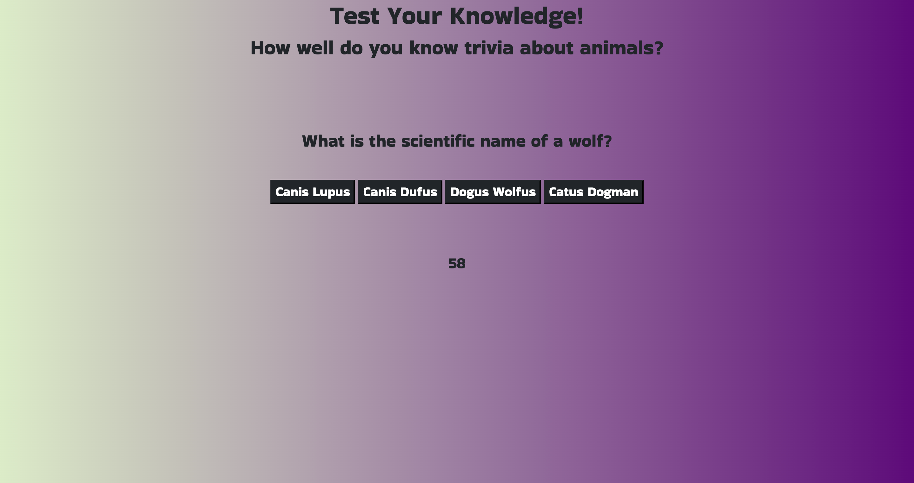

# Animal Trivia Quiz

## Description

This project was to create a webpage showcasing JavaScript, HTML, and CSS that enables the webpage to load a dynamically updated code quiz game. This responsive interface was created to feature a quiz game about animal facts. As the user clicks start, a countdown timer begins and trivia questions appear. For every correct answer to each question, 1 point is added to the user's score and for every wrong answer 0 points are awarded for that round of question and additionall 10 seconds are taken off of the clock. As the countdown hits 0, the game is over. Or, if the user answers all five questions, the game is also over. When the game is finished the user will be prompted to enter their initials for record keeping and to see their final score.

- [Installation](#installation)
- [Usage](#usage)
- [Credits](#credits)
- [License](#license)

## Installation

The files along with the assets folder were deployed using GitHub Pages and can be used to open up the webpage. The quiz is hosted through GitHub pages, at: https://danielwestiner.github.io/code-quiz/ The indivial files can be accessed through my personal GitHub repository located: https://github.com/DanielWestiner/code-quiz

## Usage

The files can be viewed using any desktop browser for viewing.
The navigation can be used to browse different sections and will be updated as they become populated with projects.

## Credits

Collaborators on this project include the UPENN bootcamp cohort, teaching staff, and tutor Alexis San Javier who helped make edits to this project. Some concepts and syntax tips were learned from Colt Steele and his Udemy Bootcamp course. Animal trivia questions were obtained from http://www.opinionstage.com/blog/trivia-questions

## License

MIT License

Copyright (c) [2021] [Daniel Westiner]

Permission is hereby granted, free of charge, to any person obtaining a copy
of this software and associated documentation files (the "Software"), to deal
in the Software without restriction, including without limitation the rights
to use, copy, modify, merge, publish, distribute, sublicense, and/or sell
copies of the Software, and to permit persons to whom the Software is
furnished to do so, subject to the following conditions:

The above copyright notice and this permission notice shall be included in all
copies or substantial portions of the Software.

---
